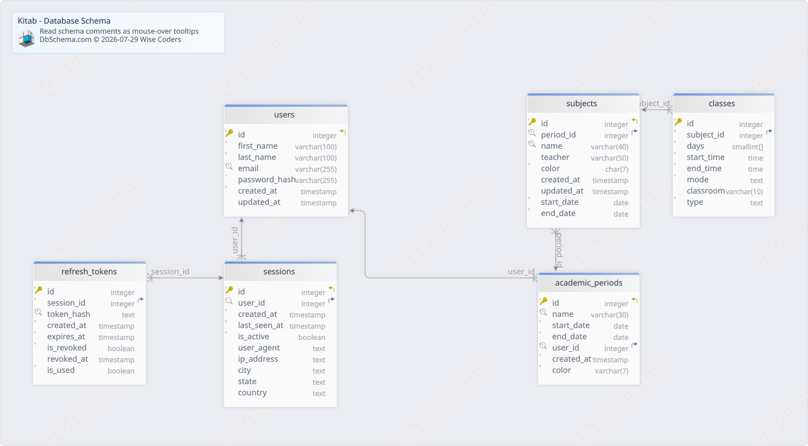

#Kitab - Database Schema
Generated using [DbSchema](https://dbschema.com)

### ~Diagram with Sample Tools

## Tables

1. [public.academic_periods](#table%20public.academic\_periods) 
2. [public.classes](#table%20public.classes) 
3. [public.refresh_tokens](#table%20public.refresh\_tokens) 
4. [public.sessions](#table%20public.sessions) 
5. [public.subjects](#table%20public.subjects) 
6. [public.users](#table%20public.users) 

### Table public.academic_periods 
|Idx |Name |Data Type |
|---|---|---|
| * &#128273;  &#11019; | id| integer GENERATED ALWAYS AS IDENTITY |
| * &#128269; | name| varchar(30)  |
| * | start\_date| date  |
| * | end\_date| date  |
| * &#128269; &#11016; | user\_id| integer  |
| * | created\_at| timestamp  DEFAULT CURRENT_TIMESTAMP |
| * | color| varchar(7)  |

##### Indexes 
|Type |Name |On |
|---|---|---|
| &#128273;  | academic\_periods\_pkey | ON id|
| &#128269;  | academic\_periods\_user\_id\_name\_key | ON user\_id, name|

##### Foreign Keys
|Type |Name |On |
|---|---|---|
|  | academic_periods_user_id_fkey | ( user\_id ) ref [public.users](#users) (id) |

##### Constraints
|Name |Definition |
|---|---|
| academic_periods_check | start\_date &lt; end\_date |

### Table public.classes 
|Idx |Name |Data Type |Description |
|---|---|---|---|
| * &#128273;  | id| integer GENERATED ALWAYS AS IDENTITY |  |
| * &#11016; | subject\_id| integer  |  |
| * | days| smallint[]  | 1=Lunes, 2=Martes, 3=Miércoles, 4=Jueves, 5=Viernes, 6=Sábado, 7=Domingo |
| * | start\_time| time  |  |
| * | end\_time| time  |  |
| * | mode| text  |  |
|  | classroom| varchar(10)  |  |
| * | type| text  |  |

##### Indexes 
|Type |Name |On |
|---|---|---|
| &#128273;  | classes\_pkey | ON id|

##### Foreign Keys
|Type |Name |On |
|---|---|---|
|  | subject_fk | ( subject\_id ) ref [public.subjects](#subjects) (id) |

##### Constraints
|Name |Definition |
|---|---|
| days_check | days &lt;@ ARRAY[(1)::smallint, (2)::smallint, (3)::smallint, (4)::smallint, (5)::smallint, (6)::smallint, (7)::smallint] |
| days_not_empty | cardinality(days) &gt; 0 |
| mode_check | mode = ANY (ARRAY['onsite'::text, 'online'::text]) |
| time_check | end\_time &gt; start\_time |
| type_check | type = ANY (ARRAY['theory'::text, 'laboratory'::text, 'workshop'::text]) |

### Table public.refresh_tokens 
|Idx |Name |Data Type |
|---|---|---|
| * &#128273;  | id| integer GENERATED ALWAYS AS IDENTITY |
| * &#11016; | session\_id| integer  |
| * &#128269; | token\_hash| text  |
| * | created\_at| timestamp  DEFAULT CURRENT_TIMESTAMP |
| * | expires\_at| timestamp  |
| * | is\_revoked| boolean  DEFAULT false |
|  | revoked\_at| timestamp  |
| * | is\_used| boolean  DEFAULT false |

##### Indexes 
|Type |Name |On |
|---|---|---|
| &#128273;  | refresh\_tokens\_pkey | ON id|
| &#128269;  | idx\_refresh\_tokens\_token\_hash | ON token\_hash|

##### Foreign Keys
|Type |Name |On |
|---|---|---|
|  | refresh_tokens_session_id_fkey | ( session\_id ) ref [public.sessions](#sessions) (id) |

### Table public.sessions 
|Idx |Name |Data Type |
|---|---|---|
| * &#128273;  &#11019; | id| integer GENERATED ALWAYS AS IDENTITY |
| * &#128270; &#11016; | user\_id| integer  |
| * | created\_at| timestamp  DEFAULT CURRENT_TIMESTAMP |
| * | last\_seen\_at| timestamp  DEFAULT CURRENT_TIMESTAMP |
| * | is\_active| boolean  DEFAULT true |
|  | user\_agent| text  |
|  | ip\_address| text  |
|  | city| text  |
|  | state| text  |
|  | country| text  |

##### Indexes 
|Type |Name |On |
|---|---|---|
| &#128273;  | sessions\_pkey | ON id|
| &#128270;  | sessions\_user\_id\_idx | ON user\_id|

##### Foreign Keys
|Type |Name |On |
|---|---|---|
|  | sessions_user_id_fkey | ( user\_id ) ref [public.users](#users) (id) |

### Table public.subjects 
|Idx |Name |Data Type |
|---|---|---|
| * &#128273;  &#11019; | id| integer GENERATED ALWAYS AS IDENTITY |
| * &#128269; &#11016; | period\_id| integer  |
| * &#128269; | name| varchar(40)  |
|  | teacher| varchar(50)  |
| * | color| char(7)  |
|  | created\_at| timestamp  DEFAULT now() |
|  | updated\_at| timestamp  DEFAULT now() |
| * | start\_date| date  |
| * | end\_date| date  |

##### Indexes 
|Type |Name |On |
|---|---|---|
| &#128273;  | subjects\_pkey | ON id|
| &#128269;  | period\_subject\_unique | ON period\_id, name|

##### Foreign Keys
|Type |Name |On |
|---|---|---|
|  | period_fk | ( period\_id ) ref [public.academic\_periods](#academic\_periods) (id) |

##### Constraints
|Name |Definition |
|---|---|
| dates_check | end\_date &gt; start\_date |

### Table public.users 
|Idx |Name |Data Type |
|---|---|---|
| * &#128273;  &#11019; | id| integer GENERATED ALWAYS AS IDENTITY |
| * | first\_name| varchar(100)  |
| * | last\_name| varchar(100)  |
| * &#128269; | email| varchar(255)  |
| * | password\_hash| varchar(255)  |
| * | created\_at| timestamp  DEFAULT CURRENT_TIMESTAMP |
|  | updated\_at| timestamp  |

##### Indexes 
|Type |Name |On |
|---|---|---|
| &#128273;  | users\_pkey | ON id|
| &#128269;  | users\_email\_key | ON email|

